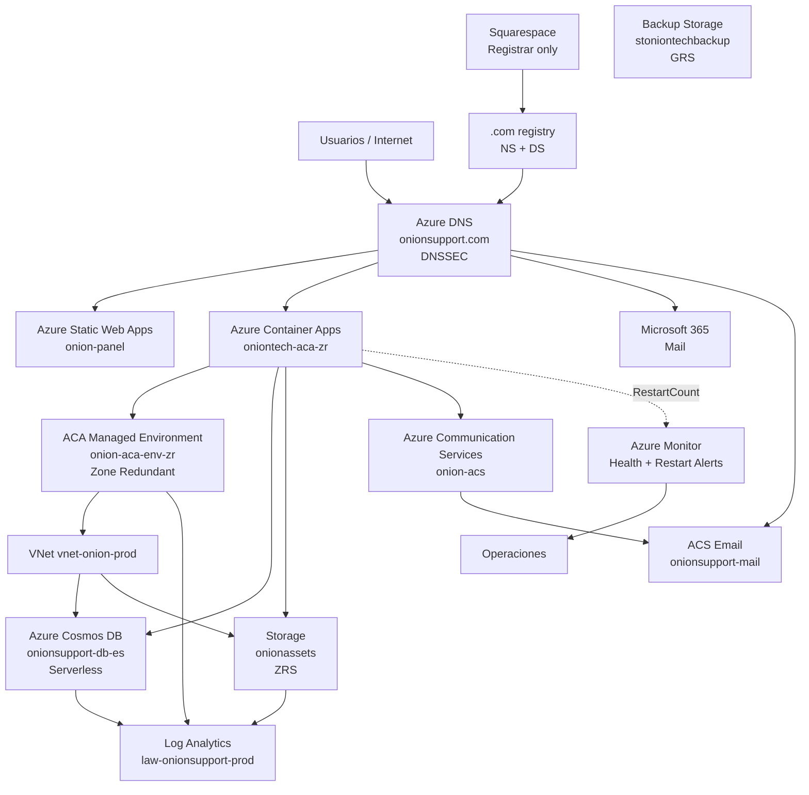

# ONION SUPPORT — INFRAESTRUCTURA AZURE

> Actualizado: 2026-09-04.
> Este documento conserva el inventario validado durante la auditoría, limpieza y migración DNS de septiembre de 2026. No es una lectura continua de Azure ni acredita por sí solo la revisión desplegada después de aquella auditoría. El release frontend está en [PROJECT_CONTEXT.md](PROJECT_CONTEXT.md); revisiones, imagen y probes del backend se mantienen en el [estado operativo de oniontech](https://github.com/avila199817/oniontech/blob/main/docs/COMO_LO_TENEMOS_AHORA.md).
>
> **Regla de seguridad:** los identificadores de tenant, suscripción, App Registration, principal y otros IDs internos se omiten intencionadamente de esta documentación pública. No son necesarios para comprender ni operar la arquitectura.

## 1. Alcance y estado canónico

La infraestructura productiva de Onion Support usa principalmente **Spain Central**, con servicios auxiliares en **West Europe** y **West US 2** cuando el servicio Azure lo requiere.

Estado validado:

- 7 Resource Groups;
- 32 recursos ARM visibles antes del cierre de la auditoría de limpieza;
- 0 Managed Disks huérfanos;
- 0 NIC huérfanas;
- 0 Public IPs huérfanas;
- 0 snapshots ARM;
- un único stack ACA legacy conservado expresamente como rollback;
- locks `CanNotDelete` consolidados a una sola protección por recurso crítico;
- IAM/CI-CD separado por responsabilidad y autenticado mediante OIDC;
- **Azure DNS es la única autoridad DNS pública de `onionsupport.com`**;
- **Squarespace queda como registrador del dominio**, no como DNS operativo;
- DNSSEC está habilitado en Azure DNS y delegado desde `.com` mediante DS;
- SPF raíz y SPF de ACS usan `-all`;
- CAA permite DigiCert y bloquea explícitamente certificados wildcard.

La autoridad operativa es Azure y el código de `main` de los repositorios correspondientes. Si este documento diverge de la infraestructura real, debe actualizarse después de verificar Azure.

## 2. Arquitectura de alto nivel



`stoniontechbackup` se representa como recurso independiente porque la auditoría confirmó actividad de backup, pero no estableció un flujo único de origen que deba dibujarse como dependencia canónica.

## 3. Resource Groups

| Resource Group | Región del RG | Responsabilidad |
|---|---|---|
| `onion-web` | Spain Central | Backend, Container Apps, Cosmos DB, red privada, observabilidad y ACS |
| `rg-onion-storage` | Spain Central | Storage productivo `onionassets` |
| `rg-onion-backups` | Spain Central | Storage de backup `stoniontechbackup` |
| `onionsupport-rg` | West US 2 | Static Web App, Azure DNS y ACS Email |
| `ME_onion-aca-env-zr_onion-web_spaincentral` | Spain Central | Infraestructura administrada por Azure Container Apps |
| `NetworkWatcherRG` | Spain Central | Network Watcher administrado por Azure |
| `cloud-shell-storage-westeurope` | West Europe | Persistencia de Azure Cloud Shell |

### 3.1 Grupos administrados o auxiliares

`ME_onion-aca-env-zr_onion-web_spaincentral`, `NetworkWatcherRG` y `cloud-shell-storage-westeurope` no deben tratarse como basura por el nombre.

- El grupo `ME_...` contiene infraestructura administrada por Azure Container Apps, actualmente un Load Balancer Standard y una Public IP Standard.
- `NetworkWatcherRG` contiene `NetworkWatcher_spaincentral`.
- `cloud-shell-storage-westeurope` contiene el Storage Account usado por Cloud Shell y su File Share persistente.

**No modificar manualmente los recursos del grupo `ME_...` salvo documentación oficial y necesidad explícita.**

## 4. Frontend — Azure Static Web Apps

Recurso productivo:

- Resource Group: `onionsupport-rg`
- Static Web App: `onion-panel`
- SKU: `Free`
- rama productiva: `main`
- proveedor: GitHub
- dominios personalizados:
  - `onionsupport.com`
  - `www.onionsupport.com`
- ambos dominios personalizados en estado `Ready`;
- entornos activos: sólo `default`.

El apex usa **Azure DNS Alias** al recurso `onion-panel`, no un A record fijado manualmente.

Los certificados públicos de `onionsupport.com` y `www.onionsupport.com` fueron verificados como emitidos por DigiCert/GeoTrust y administrados por Azure Static Web Apps.

No se detectaron staging environments o previews abandonados en la auditoría.

La aplicación frontend vive en el repositorio `avila199817/onionsupport`.

## 5. Backend — Azure Container Apps

### 5.1 Producción actual

Container App:

- nombre: `oniontech-aca-zr`
- Resource Group: `onion-web`
- región: Spain Central
- Managed Environment: `onion-aca-env-zr`
- Zone Redundant: `true`
- workload profile: `Consumption`
- ingress: público HTTPS
- target port: `8080`
- revisión activa: modo `Single`
- CPU: `1.0`
- memoria: `2 GiB`
- escalado: mínimo `2`, máximo `3` réplicas
- estado validado: 2 réplicas `Running`.

El dominio productivo `api.onionsupport.com` resuelve directamente al FQDN generado de `oniontech-aca-zr`.

El certificado público de `api.onionsupport.com` fue verificado como emitido por DigiCert/GeoTrust.

### 5.2 Imagen

La aplicación usa una imagen inmutable de GHCR referenciada por digest SHA-256, no por tag mutable.

Durante la migración legacy -> ZR se validó que OLD y ZR ejecutaban exactamente el mismo digest de imagen y la misma configuración funcional relevante.

## 6. Stack legacy / rollback

El stack anterior se conserva temporalmente como rollback y **no forma parte del tráfico productivo normal**.

Recursos legacy:

- Container App: `oniontech-aca`
- Managed Environment: `onion-aca-env`
- Managed Certificate: `mc-onion-aca-env-api-onionsupport-9588`
- Diagnostic Setting del environment legacy
- System Assigned Managed Identity legacy y sus role assignments
- Contributor del principal de deploy sobre el Container App legacy
- locks `CanNotDelete` del Container App y del environment.

Estado validado:

- `minReplicas = 0`
- `maxReplicas = 3`
- 0 réplicas activas
- fuera del DNS productivo
- conserva binding de `api.onionsupport.com` sólo como capacidad de rollback.

OLD y ZR comparten el mismo `customDomainVerificationId`, por lo que el registro `asuid.api` productivo continúa siendo válido durante y después del decommission del legacy.

El stack legacy **no debe eliminarse hasta cerrar formalmente la ventana de rollback**.

## 7. Red

### 7.1 VNet

VNet productiva:

- `vnet-onion-prod`
- address space: `10.42.0.0/16`.

Subnets:

| Subnet | Prefix | Uso |
|---|---|---|
| `snet-aca-infra` | `10.42.0.0/21` | Infraestructura de Container Apps ZR |
| `snet-private-endpoints` | `10.42.16.0/24` | Private Endpoints |

### 7.2 Private Endpoints

Private Endpoints productivos:

- `pe-cosmos-onionsupport`
- `pe-onionassets-blob`.

Las NIC asociadas pertenecen a esos Private Endpoints y no son huérfanas.

### 7.3 Private DNS

Zonas privadas:

- `privatelink.documents.azure.com`
- `privatelink.blob.core.windows.net`.

Virtual Network Links:

- `link-cosmos-onion-prod`
- `link-blob-onion-prod`.

## 8. Azure Cosmos DB

Cuenta productiva:

- nombre: `onionsupport-db-es`
- región: Spain Central
- modo: **Serverless**
- consistencia: `Session`
- multi-region writes: deshabilitado
- Public Network Access: deshabilitado
- autenticación local: deshabilitada
- backup: `Continuous`
- tier de backup: `Continuous30Days`.

Base de datos SQL: `onionsupport`.

Containers conocidos:

| Container | Partition Key | TTL observado |
|---|---|---|
| `sessions` | `/userId` | `-1` |
| `clientes` | `/id` | — |
| `tickets` | `/ticketId` | — |
| `users_lookup` | `/id` | — |
| `facturas` | `/clienteId` | — |
| `hardware` | `/userId` | — |
| `usuarios` | `/userId` | — |
| `settings` | `/userId` | — |

Las Managed Identities de los Container Apps productivo y legacy tienen `Cosmos DB Built-in Data Contributor` mientras dure el rollback.

## 9. Storage productivo — `onionassets`

Storage Account:

- Resource Group: `rg-onion-storage`
- región: Spain Central
- SKU: `Standard_ZRS`
- kind: `StorageV2`
- HTTPS only: habilitado
- mínimo TLS: `TLS1_2`
- Shared Key Access: deshabilitado
- versioning: habilitado
- Change Feed: habilitado
- Blob Soft Delete: 30 días
- Container Soft Delete: 30 días
- lifecycle: elimina versiones antiguas después de 30 días.

Capacidad observada durante la auditoría: aproximadamente **753 MiB**.

Containers públicos por diseño (`PublicAccess=blob`):

- `$web`
- `avatars`
- `bimi`.

Privados:

- `facturasonionsupport`
- `tickets`.

Por este motivo no debe deshabilitarse globalmente el acceso público de blobs sin rediseñar antes la separación entre assets públicos y datos privados.

El backend accede al Storage mediante Managed Identity con `Storage Blob Data Contributor` y existe Private Endpoint para Blob.

## 10. Backup Storage — `stoniontechbackup`

Storage Account:

- Resource Group: `rg-onion-backups`
- datos almacenados en West Europe
- SKU: `Standard_GRS`
- Public Network Access: deshabilitado
- Shared Key Access: deshabilitado
- HTTPS only: habilitado
- mínimo TLS: `TLS1_2`
- versioning: habilitado
- Change Feed: habilitado
- Blob Soft Delete: 90 días
- Container Soft Delete: 90 días
- lifecycle: elimina versiones antiguas después de 90 días.

Capacidad observada durante la auditoría: aproximadamente **47 MiB**.

Se verificó actividad real de backup mediante métricas de Storage, incluyendo operaciones de escritura/creación e ingress/egress. Por tanto, este recurso no es residual.

## 11. Cloud Shell Storage

Storage Account:

- `csb100320058483f6e2`
- Resource Group: `cloud-shell-storage-westeurope`
- SKU: `Standard_LRS`
- región: West Europe.

El File Share persistente de Cloud Shell tiene uso real y no debe considerarse residuo.

## 12. Observabilidad

### 12.1 Log Analytics

Workspace:

- `law-onionsupport-prod`
- región: Spain Central
- SKU: `PerGB2018`
- retención: 30 días
- daily quota: `0.1 GB`.

Durante la auditoría se observaron aproximadamente **117 MB ingeridos en 7 días**, incluyendo logs de Container Apps, métricas Azure, Cosmos DB y Storage.

El workspace está activo y no es un recurso residual.

### 12.2 Diagnostic Settings

`onion-aca-env-zr` envía:

- `ContainerAppHTTPLogs`
- `AllMetrics`
- destino: `law-onionsupport-prod`.

El mismo setting se mantiene temporalmente en `onion-aca-env` mientras exista el rollback.

Cosmos DB y Storage también mantienen Diagnostic Settings productivos hacia Log Analytics.

## 13. Alertas

Action Group:

- `ag-onionsupport-ops`
- habilitado
- receptor principal por email.

Activity Log Alerts:

- `service-health-onionsupport`
- `resource-health-onionsupport`.

Metric Alert:

- `containerapp-restarts-onionsupport`
- scope actual: `oniontech-aca-zr`
- métrica: `RestartCount`
- condición: `> 3`
- ventana: 5 minutos
- frecuencia: 1 minuto
- severidad: 2.

Durante la auditoría esta alerta fue migrada desde el ACA legacy al ACA ZR productivo.

## 14. Dominio y DNS público

### 14.1 Registrar y autoridad

`onionsupport.com` está registrado en **Squarespace**, pero Squarespace **no es la autoridad DNS productiva**.

Responsabilidades canónicas:

- **Squarespace**: registrar del dominio, custodia administrativa, custom nameservers y publicación del DS DNSSEC.
- **Azure DNS**: única autoridad DNS pública y única zona que debe modificarse operativamente.

Delegación pública:

```text
ns1-06.azure-dns.com
ns2-06.azure-dns.net
ns3-06.azure-dns.org
ns4-06.azure-dns.info
```

La delegación fue validada directamente contra el parent `.com` y contra resolvers públicos.

La antigua zona DNS de Squarespace/Google Domains se mantiene únicamente como **rollback temporal para caches de delegación anteriores al cutover**. No debe volver a considerarse fuente de verdad ni editarse como zona productiva. Una vez vencida la ventana de compatibilidad de caché, sus Custom Records deben eliminarse.

### 14.2 DNSSEC

Azure DNS firma `onionsupport.com` mediante DNSSEC.

Estado validado:

- provisioning state: `Succeeded`;
- algoritmo: ECDSAP256SHA256 (`13`);
- KSK publicada y DS delegado en `.com`;
- digest type: SHA-256 (`2`);
- resolvers `1.1.1.1`, `8.8.8.8` y `9.9.9.9` responden con flag `ad` para la zona.

El DS está publicado en Squarespace porque Squarespace es el registrar. **No modificar ni eliminar el DS mientras DNSSEC esté habilitado en Azure DNS.**

### 14.3 Resolución productiva

- apex `onionsupport.com` -> Azure DNS Alias -> `onion-panel`;
- `www.onionsupport.com` -> Azure Static Web Apps;
- `api.onionsupport.com` -> `oniontech-aca-zr`;
- `autodiscover.onionsupport.com` -> Microsoft 365 / Outlook;
- MX -> Microsoft 365;
- DKIM selector 1/2 -> Microsoft 365;
- `mail.onionsupport.com` -> dominio de ACS Email;
- DKIM1/DKIM2 de ACS están bajo `*.mail.onionsupport.com`, no en el root.

### 14.4 SPF, DMARC, BIMI y CAA

SPF raíz:

```text
v=spf1 include:spf.protection.outlook.com -all
```

SPF de ACS `mail.onionsupport.com`:

```text
v=spf1 include:spf.protection.outlook.com -all
```

DMARC raíz:

```text
v=DMARC1; p=quarantine; pct=100; rua=mailto:dmarc@onionsupport.com
```

BIMI:

```text
v=BIMI1; l=https://onionassets.blob.core.windows.net/bimi/logo.svg
```

CAA final:

```text
0 issue "digicert.com"
0 issuewild ";"
```

Sólo DigiCert queda autorizado para emisión normal y la emisión wildcard queda explícitamente denegada.

Los certificados públicos activos inspeccionados para apex, `www` y `api` fueron emitidos por DigiCert/GeoTrust.

### 14.5 TXT de validación

El apex mantiene únicamente los TXT que siguen teniendo una función administrativa o de ownership conocida:

- Google site verification;
- OpenAI domain verification;
- SPF raíz.

Se retiraron como residuos demostrados:

- `MS=...` de verificación inicial de Microsoft 365;
- tokens SWA antiguos y de validación ya completada;
- `_dnsauth`, `_dnsauth.www` y `_dnsauth.api`;
- `asuid` del apex.

Se conserva `asuid.api` porque coincide con el `customDomainVerificationId` del ACA productivo.

Durante la auditoría también se eliminó un TXT DMARC mal formado cuyo nombre relativo generaba accidentalmente:

```text
_dmarc.mail.onionsupport.com.onionsupport.com
```

La zona `onionsupport.com` mantiene un lock `CanNotDelete`.

## 15. Azure Communication Services y Email

Communication Service:

- `onion-acs`
- data location: Europe.

Email Service:

- `onionsupport-mail`
- data location: Europe.

Dominio:

- `mail.onionsupport.com`
- gestión: `CustomerManaged`
- Domain verification: `Verified`
- SPF: `Verified`
- DKIM: `Verified`
- DKIM2: `Verified`
- DMARC en ACS: `NotStarted` — la política DMARC se gestiona en DNS raíz.

Después del cutover de nameservers se forzó una nueva verificación de `Domain`, `SPF`, `DKIM` y `DKIM2`; todos regresaron a `Verified` contra Azure DNS.

DKIM de ACS:

- `selector1-azurecomm-prod-net._domainkey.mail.onionsupport.com`
- `selector2-azurecomm-prod-net._domainkey.mail.onionsupport.com`.

Sender configurado:

- username: `DoNotReply`
- display name: `Onion Support`.

## 16. IAM y principio de mínimo privilegio

### 16.1 Usuarios humanos

La suscripción mantiene dos cuentas Owner:

- operador principal;
- cuenta break-glass.

La elevación temporal `User Access Administrator` a scope `/` fue retirada al finalizar la auditoría IAM.

### 16.2 Managed Identities de Container Apps

Producción `oniontech-aca-zr`:

- `Cost Management Reader` en suscripción
- `Storage Blob Data Contributor` sobre `onionassets`
- `Cosmos DB Built-in Data Contributor` sobre `onionsupport-db-es`.

Legacy `oniontech-aca` mantiene temporalmente permisos equivalentes sólo para preservar rollback.

### 16.3 GitHub OIDC

No se usan passwords o certificados persistentes en las App Registrations de CI/CD auditadas.

Las credenciales federadas usan GitHub OIDC y subject inmutable basado en IDs del owner/repository.

Se eliminó el FIC legacy basado únicamente en nombres del repositorio.

Responsabilidades separadas:

| Identidad | Uso | RBAC |
|---|---|---|
| `oniontech-github-deploy` | Deployment backend | `Contributor` limitado a los Container Apps necesarios |
| `chatgpt-onionsupport-audit` | Gateway de auditoría Azure | `Reader` limitado a RGs aprobados |
| `oniontech-factura-audit` | Auditoría de integridad de facturas dentro del ACA productivo | `Container Apps Operator` sólo sobre `oniontech-aca-zr` |

## 17. CI/CD backend

El backend privado usa GitHub Actions y OIDC para Azure.

Variables operativas verificadas:

- Resource Group productivo: `onion-web`
- Container App productivo: `oniontech-aca-zr`.

Workflows principales:

- `production.yml`
  - identidad de deploy;
  - construye imagen inmutable;
  - despliega sólo cuando corresponde;
  - provenance gate que rechaza producción automática desde pushes directos que no proceden de un PR mergeado.

- `azure-readonly-audit.yml`
  - identidad Reader dedicada;
  - limita Resource Groups y operaciones permitidas;
  - autenticación OIDC validada end-to-end.

- `factura-integrity-maintenance.yml`
  - identidad `Container Apps Operator` dedicada;
  - ejecuta auditoría de sólo lectura dentro de la réplica productiva mediante `az containerapp exec`;
  - no utiliza la identidad Contributor de deploy.

Un cambio de workflow CI-only o `docs/**` no debe requerir nuevo despliegue de runtime frontend/backend cuando el workflow correspondiente lo excluye expresamente.

## 18. Locks de producción

La auditoría consolidó locks duplicados y dejó **una única protección `CanNotDelete` por recurso crítico**.

Protegidos actualmente:

- `onion-acs`
- alertas Service Health / Resource Health / RestartCount
- `ag-onionsupport-ops`
- `law-onionsupport-prod`
- ACA legacy y ACA ZR
- Managed Environments legacy y ZR
- `onionsupport-db-es`
- Private Endpoints
- Private DNS Zones
- `vnet-onion-prod`
- `onionassets`
- `stoniontechbackup`
- `onion-panel`
- `onionsupport-mail`
- zona DNS `onionsupport.com`.

No volver a apilar varios locks `CanNotDelete` sobre el mismo recurso sin una razón operativa explícita.

## 19. Limpieza y hardening realizados — septiembre de 2026

Cambios realizados durante la auditoría:

1. inventario completo de Resource Groups y recursos;
2. verificación de ausencia de discos, NICs, Public IPs y snapshots huérfanos;
3. identificación de ACA legacy vs nuevo ACA Zone Redundant;
4. validación de DNS y tráfico de la migración ACA;
5. comparación OLD/ZR de imagen, CPU/RAM, env vars, secrets, registry y RBAC;
6. `oniontech-aca` reducido de `minReplicas=1` a `minReplicas=0`;
7. verificación posterior de 0 réplicas legacy;
8. eliminación de cuatro locks redundantes de Storage/Backup;
9. migración de `containerapp-restarts-onionsupport` desde OLD a ZR;
10. creación del Diagnostic Setting faltante en `onion-aca-env-zr`;
11. validación de Storage, lifecycle, Cosmos, backups y Log Analytics;
12. eliminación del TXT DMARC mal formado;
13. retirada de la elevación `User Access Administrator @ /`;
14. separación de identidad de deploy e identidad Azure Reader;
15. eliminación del FIC OIDC legacy basado en nombre;
16. creación de identidad dedicada `Container Apps Operator` para Factura Audit;
17. validación del destino CI/CD productivo `oniontech-aca-zr`;
18. migración de la delegación pública desde Squarespace/Google Domains hacia Azure DNS;
19. verificación de los cuatro nameservers de Azure contra `.com`, Cloudflare, Google y Quad9;
20. corrección de `api.onionsupport.com` para apuntar exclusivamente al ACA ZR;
21. corrección de DKIM1/DKIM2 de ACS bajo `mail.onionsupport.com`;
22. revalidación post-cutover de Domain/SPF/DKIM/DKIM2 en ACS;
23. habilitación de DNSSEC en Azure DNS;
24. publicación del DS en Squarespace como registrar;
25. validación DNSSEC end-to-end con flag `ad` en resolvers públicos;
26. eliminación de TXT de validación y residuos DNS demostrados;
27. endurecimiento SPF raíz de `~all` a `-all`;
28. CAA reducido a DigiCert y wildcard issuance bloqueada;
29. captura de snapshots post-cutover y extreme-state con verificación SHA-256;
30. restauración y validación del lock `CanNotDelete` después de cada ventana de mantenimiento DNS.

## 20. Plan de decommission del ACA legacy

### 20.1 Preconditions

No ejecutar hasta confirmar:

- `api.onionsupport.com` sigue resolviendo exclusivamente al ACA ZR;
- `oniontech-aca-zr` está sano y con réplicas productivas;
- no existen requests recientes al OLD;
- `oniontech-aca` continúa con 0 réplicas;
- el pipeline productivo apunta a `oniontech-aca-zr`;
- la ventana de rollback ha sido cerrada explícitamente.

### 20.2 Orden recomendado

1. capturar snapshot final de configuración OLD;
2. retirar locks `CanNotDelete` únicamente del stack legacy;
3. retirar Contributor del principal de deploy sobre `oniontech-aca`;
4. retirar Azure RBAC de la Managed Identity OLD;
5. retirar Cosmos data-plane role assignment de la Managed Identity OLD;
6. quitar binding de `api.onionsupport.com` del ACA OLD;
7. eliminar managed certificate OLD;
8. eliminar Diagnostic Setting OLD;
9. eliminar `oniontech-aca`;
10. verificar que el Managed Environment OLD está vacío;
11. eliminar `onion-aca-env`;
12. repetir orphan check, locks, IAM y Resource Graph;
13. actualizar este documento y el changelog operativo.

### 20.3 Resultado esperado

Después del decommission deben desaparecer:

- `oniontech-aca`
- `onion-aca-env`
- `mc-onion-aca-env-api-onionsupport-9588`
- identidad gestionada OLD y sus role assignments
- Contributor GitHub sobre OLD
- Diagnostic Setting OLD
- locks OLD.

El stack ZR y todos sus recursos administrados deben permanecer intactos.

## 21. Comandos de auditoría seguros

### Inventario

```bash
az graph query -q "
Resources
| project Grupo=resourceGroup, Nombre=name, Tipo=type, Region=location
| order by Grupo asc, Tipo asc, Nombre asc
" --query data -o table
```

### Orphan check

```bash
az graph query -q "
Resources
| where type =~ 'microsoft.compute/disks'
| where isempty(managedBy)
| project Grupo=resourceGroup,Nombre=name
" --query data -o table

az graph query -q "
Resources
| where type =~ 'microsoft.network/networkinterfaces'
| where isempty(properties.virtualMachine.id)
| where isempty(properties.privateEndpoint.id)
| project Grupo=resourceGroup,Nombre=name
" --query data -o table
```

### Container Apps

```bash
az containerapp list -g onion-web \
  --query "[].{App:name,Estado:properties.runningStatus,Min:properties.template.scale.minReplicas,Max:properties.template.scale.maxReplicas,FQDN:properties.configuration.ingress.fqdn}" \
  -o table
```

### DNS authority + DNSSEC

```bash
dig +short NS onionsupport.com | sort
dig +short DS onionsupport.com

for DNS in 1.1.1.1 8.8.8.8 9.9.9.9; do
  printf '%-10s ' "$DNS"
  dig @"$DNS" onionsupport.com A +dnssec +adflag | awk '/flags:/{print; exit}'
done
```

### Locks

```bash
az lock list \
  --query "[].{Nombre:name,Nivel:level,Notas:notes,Id:id}" \
  -o table
```

### IAM

```bash
az role assignment list \
  --all \
  --query "[].{Principal:principalName,Tipo:principalType,Rol:roleDefinitionName,Scope:scope}" \
  -o table
```

## 22. Principios operativos

1. **No borrar por nombre.** Verificar dependencias, tráfico, DNS, métricas y RBAC antes de eliminar.
2. **Producción se protege con locks, no con duplicación de locks.** Una protección clara por recurso crítico.
3. **OIDC antes que secretos persistentes.** CI/CD no debe depender de client secrets de larga duración.
4. **Una identidad por responsabilidad.** Deploy, auditoría general y auditoría de facturas tienen permisos distintos.
5. **Private Endpoint donde los datos lo requieren.** Cosmos y Blob privados deben seguir integrados con VNet y Private DNS.
6. **Observabilidad no se elimina para ahorrar céntimos.** Log Analytics y Diagnostic Settings actuales tienen uso demostrado.
7. **Los recursos administrados por Azure no se limpian manualmente.** Especialmente el RG `ME_...` de Container Apps.
8. **Rollback debe tener fecha de caducidad.** El stack legacy existe temporalmente y debe retirarse después de cerrar la ventana de seguridad.
9. **Squarespace es registrar, Azure DNS es autoridad.** No mantener dos zonas DNS operativas editables.
10. **DNSSEC requiere coordinación registrar/autoridad.** Si se deshabilita DNSSEC en Azure, retirar antes el DS del parent; si se rota KSK, coordinar la actualización del DS.
11. **CAA debe reflejar emisores reales.** No autorizar CAs que no tengan un consumidor demostrado.
12. **Documentar después de cada cambio estructural.** Este archivo debe reflejar el estado real, no una intención histórica.

## 23. Próximas acciones

- [ ] Cerrar la ventana de compatibilidad de caché y eliminar los Custom Records legacy de Squarespace; mantener únicamente registrar, custom nameservers y DS DNSSEC.
- [ ] Confirmar si el TXT de OpenAI puede retirarse sin perder ninguna asociación administrativa necesaria.
- [ ] Mantener Google site verification mientras Google Search Console dependa de ese método de ownership.
- [ ] Evaluar `DMARC p=reject` sólo después de revisar alineación real y reportes DMARC.
- [ ] Cerrar formalmente la ventana de rollback del ACA legacy.
- [ ] Ejecutar el decommission siguiendo la sección 20.
- [ ] Repetir Resource Graph + orphan check + IAM después del decommission.
- [ ] Actualizar este documento eliminando el bloque legacy.
- [ ] Revisar periódicamente costes, daily quota de logs y capacidad de Storage.

---

**Estado de la auditoría:** infraestructura productiva validada, Azure DNS autoritativo con DNSSEC end-to-end y hardening aplicado. Pendientes deliberados: retirada de la copia DNS legacy no autoritativa de Squarespace tras expirar la compatibilidad de caché y decommission del stack ACA legacy cuando se cierre su ventana de rollback.
